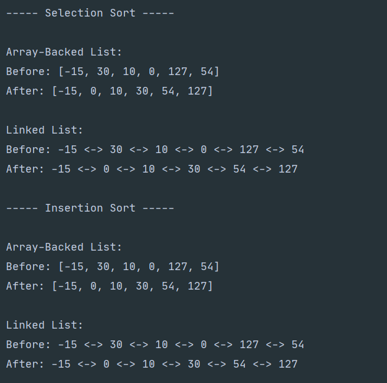

#### Sorts

###### Insertion/Selection sorts implemented entirely from scratch with the use of custom iterators 

---

The program takes a list of integers as command-line arguments and performs the following tasks: 

1. Create an Array-Backed List with provided numbers 
2. Create a Linked List with provided numbers 
3. Perform Selection Sort on both 
4. Perform Insertion Sort on both 
5. Print the results 

---

###### To run:

1. Download the files into a directory 

2. Run: _Java Sorts <list to sort>_ 

   - The <list to sort>  should be a list of integers separated by a blank space (' ')

   - i.e. Java Sorts -15 30 10 0 127 54 

     Example output for the list above: 
     
     
     
     

